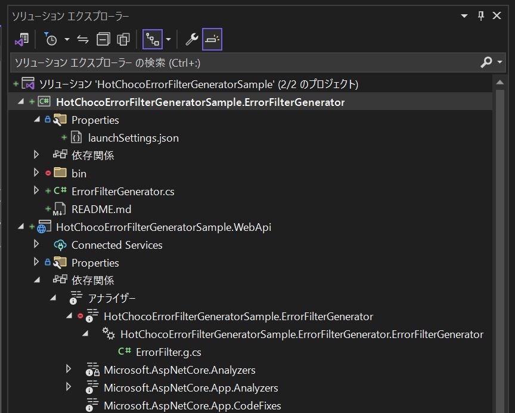
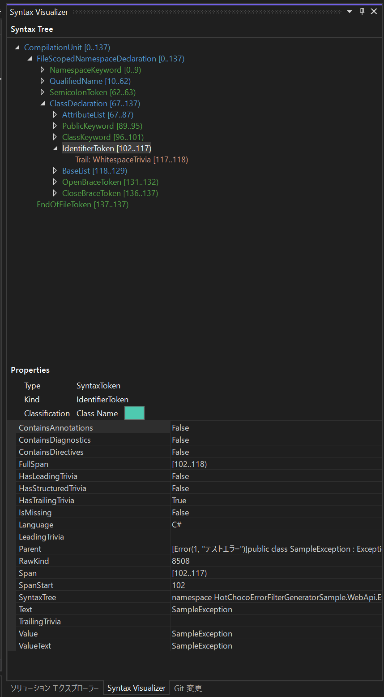

# ソースジェネレーターの使い方

## 前提

2024 年 1 月時点

開発は VS Code を使用<br>
ただし、Syntax Visualizer および Debug 時は Visual Studio を併用<br>
ソースジェネレーター側のコードを直したときに、エディタを開きなおす必要があるので、開きなおしが楽な VS Code のほうが編集は楽に感じた

VS Code の設定はここでは除く

基本的な使い方と、生成したファイルを参照する先のコードをベースにファイルを生成したいときにどのようにコードを書いていくかをメモとして残す

## 参考

https://learn.microsoft.com/ja-jp/dotnet/csharp/roslyn-sdk/source-generators-overview

## セットアップ

### 1. メインプロジェクトと作成

Console or WebAPI どちらでも<br>
サンプルは ASP.NET Core Web API を Hot Chocolate (GraphQL) とともに使用

### 2. ソリューションにソースジェネレーター用のクラスライブラリを追加する

```shell
$ dotnet new -f netstandard2.0 -o SampleGenerator
$ dotnet sln add ./SampleGenerator
```

フレームワークは netstandard2.0 を指定すること<br>
netstandard2.1 は動くらしいが未確認。ほかの.net8.0 などは使用できない

ソースジェネレーターはソースコードを解析して、ソースコードを生成できるようにしているため、以下の 2 つのライブラリを追加する

```shell
$ dotnet package add Microsoft.CodeAnalysis.CSharp
$ dotnet package add Microsoft.CodeAnalysis.Analyzers
```

```xml
<Project Sdk="Microsoft.NET.Sdk">

  <PropertyGroup>
    <TargetFramework>netstandard2.0</TargetFramework>
    <!--警告抑制用、環境によって結果が変わるたぐいのAPIなどの使用を禁止するためのものらしい-->
    <EnforceExtendedAnalyzerRules>true</EnforceExtendedAnalyzerRules>
    <!--下記3つはデバッグに必要-->
    <IsRoslynComponent>true</IsRoslynComponent>
    <EmitCompilerGeneratedFiles>true</EmitCompilerGeneratedFiles>
    <CompilerGeneratedFilesOutputPath>Generated</CompilerGeneratedFilesOutputPath>
  </PropertyGroup>

  <ItemGroup>
    <PackageReference Include="Microsoft.CodeAnalysis.CSharp" Version="4.8.0" PrivateAssets="all" />
    <PackageReference Include="Microsoft.CodeAnalysis.Analyzers" Version="3.3.4" PrivateAssets="all" />
  </ItemGroup>

  <!--デバッグに必要-->
  <ItemGroup>
    <None Include="$(OutputPath)\$(AssemblyName).dll" Pack="true" PackagePath="analyzers/dotnet/cs" Visible="false" />
  </ItemGroup>

</Project>
```

### 3. .NET Compiler Platform SDK をインストールする (任意)

生成したファイルを使用する先のプロジェクトのコードの解析結果を使いたい場合や、デバッグを行いたい場合に必要<br>
Visual Studio のインストーラーから個別に追加できる

### 4. デバッグプロファイルを追加する (任意)

デバッグをしたい場合に追加<br>
ソースジェネレーターのプロジェクトの Properties ディレクトリに launchSettings.json を作成して以下を追加する

```json
{
  "profiles": {
    "{任意の名前}": {
      "commandName": "DebugRoslynComponent",
      "targetProject": "{生成したコードを利用する側のプロジェクトのプロジェクトファイルのパス}"
    }
  }
}
```

## 実装

### 1. ソースジェネレーター用のクラスを先に追加したソースジェネレーター用のプロジェクトに追加する

クラスは GeneratorAttribute を付与する<br>
クラスは ISourceGenerator を実装する

```cs
namespace HotChocoErrorFilterGeneratorSample.ErrorFilterGenerator
{
    [Generator]
    public class ErrorFilterGenerator : ISourceGenerator
    {
        public void Execute(GeneratorExecutionContext context)
        {
            var source = SourceText.From($@"// <auto-generated/>
", Encoding.UTF8);
            context.AddSource("ErrorFilter.g.cs", source);
        }

        public void Initialize(GeneratorInitializationContext context)
        {
        }
    }
}
```

ISourceGenerator には Execute と Initialize の 2 つのメソッドが定義されているので、この 2 つを実装する

メインで使用するのは Execute メソッド<br>
このメソッドの引数の context の AddSource メソッドに生成したいコードを引数として設定することでソースコードを生成して使うことができる

生成したファイルであることをわかりやすくするために<br>
手動更新の防止のためにファイル名には「xx.g.cs」や「xx.generated.cs」のような名前にする<br>
またファイルの先頭に「// \<auto-generated />」を記載しておく

ローカルのファイルや DB の値を参考にソースを生成したい場合も Execute でデータを読み込んで使用する<br>
生成したコードを参照する先のプロジェクトのコードを参考にソースコードを生成したい場合について、下の Syntax Visualizer に記載

### 2. 生成されたコードは Visual Studio で確認できる

ビルドが通れば、ソースジェネレーターでコードが生成されているはず

ソリューションエクスプローラーの生成したファイルを参照するプロジェクトの依存関係/アナライザーを開き、<br>
その中から自分の作成したソースジェネレーターのファイル名を探す



## Syntax Visualizer

.NET Compiler Platform をインストールすると Visual Studio で使えるようになる<br>
Visual Studio の上部ツールバーから表示/その他のウィンドウ/Syntax Visualizer をクリックする

Syntax Visualizer は.NET がビルド時に実施しているコンパイル作業の結果を視覚化してくれる API<br>
構文解析などの結果を参照できる<br>
ソースジェネレーター以外にも静的解析の自作などにも利用できる



### Syntax Visualizer を使ったソースコード生成

生成したコードを参照する先のプロジェクトのコードを参考にソースコードを生成したい場合に Syntax Visualizer が便利に使える

まず、ISyntaxContextReceiver を実装するクラスを作成する<br>
このクラスを ISourceGenerator を実装したクラスの Initialize メソッドでコンテキストに登録する<br>
コンテキストに登録するとその内容が Execute で使えるようになる

```cs
namespace HotChocoErrorFilterGeneratorSample.ErrorFilterGenerator
{
    [Generator]
    public class ErrorFilterGenerator : ISourceGenerator
    {
        public void Execute(GeneratorExecutionContext context)
        {
            // コンテキストに登録されている自作SyntaxReceiverを変数に設定して使う
            if (!(context.SyntaxContextReceiver is MySyntaxReceiver syntexReceiver))
                return;

            var source = SourceText.From($@"// <auto-generated/>
", Encoding.UTF8);
            context.AddSource("ErrorFilter.g.cs", source);
        }

        public void Initialize(GeneratorInitializationContext context)
        {
            // コンテキストに自作SyntaxReceiverを登録
            context.RegisterForSyntaxNotifications(() => new MySyntaxReceiver());
        }
    }
}

// 自作SyntaxReceiver
// このクラスのプロパティとして使いたい値を設定しておく
class MySyntaxReceiver : ISyntaxContextReceiver
{
    public IList<SampleAttributeProperty> CustomExceptionProperties { get; private set; } = new List<SampleAttributeProperty>();

    public void OnVisitSyntaxNode(GeneratorSyntaxContext context)
    {
        if (context.Node is ClassDeclarationSyntax classDeclarationSyntax
            && classDeclarationSyntax.AttributeLists.Count > 0)
        {
            ITypeSymbol attributeClassSymbols = context.SemanticModel.GetDeclaredSymbol(classDeclarationSyntax) as ITypeSymbol;
            var exceptionAttribute = attributeClassSymbols.GetAttributes().FirstOrDefault(x => x.AttributeClass.Name == "ErrorAttribute");
        }
    }
}
```

ISourceGenerator を実装したクラスでは、SyntaxContext から必要なデータを読み出すことはしない<br>
自作の SyntaxReceiver クラスの OnVisitSyntaxNode メソッド内で行う<br>
このメソッドの引数の context から必要な値を探し出すために、Visual Studio の Syntax Visualizer を使う

OnVisitSyntaxNode は構文解析結果のツリー構造を上から下に何度も実行される<br>
1 回だけプロジェクトのルート構造を読むわけではない<br>
現在の Node が目的のクラスやメソッドなのかを型や名称から判別して目的の Node においてのみ処理を行うようにする

例えば、名前に Exception のついたクラスの名前をソース生成に使いたい場合<br>
コンテキストの現在の Node がクラスかどうかを判別する<br>
そのクラスの名称に Exception がついているかを判別して、ついていればその名前を別に定義したプロパティに設定しておく

xxxSyntax や xxxSymbol クラスにはかなりいろいろプロパティがある<br>
どのプロパティを使えば目当てのデータを取得できるかを Syntax Visualizer で確認しながら実装する

ちなみに ISyntaxContextReceiver のほかに ISyntaxReceiver もある<br>
ISyntaxContextReceiver のほうが使いやすいらしい？が特に比較していないので、どんな違いがあるかは不明
